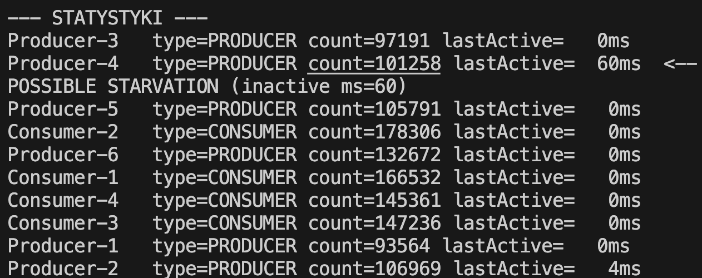
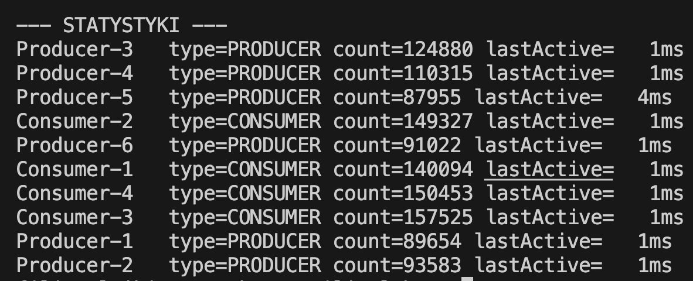

# Notatki do zadania

## A) Zagłodzenie na 2 Condition:

## B) Mechanizm zagłodzenia na 2 Condition:
#### Na dwóch Condition:
1. NotEmpty
2. NotFull

#### Mechnizm zagłodzenia jest następujący:

signal() obudzić moze niewłaściwy wątek, przez co, któryś z konsumentów/producentów rzadziej dostaje sygnał do rozpoczęcia działania mimo, ze sam proces działa normalnie

W skrócie sygnał trafia (np. w sytuacji z 2 konsumentami) trafia do konsumenta, który juz wczesniej byl aktywny, przez co czekajacy staje się pominięty.

#### Zagłodzenie na 4 Conditions z hasWaiters:

Mechanizm zagłodzenia na 4 conditions, polega na tym, ze hasWaiters mówi nam czy jakiś wątek zajmuje locka, inne czekają na restProd, w przypadku, w którym firstProd zostanie zasygnalizowany ale nie przejmie locka wystarczajaco szybko (race), czeka, później po przęjęciu locka wykonuje działanie i ląduje spowrotem na pierwszym while, odblokowując wcześniej warunek, moze zdarzyć się, ze to właśnie on przejdzie na drugiego whilea (i dzieje się to często ze wzlędu na przydzielanie zasobów procesora i JVM)

#### Zakleszczenie na 4 Conditions z hasWaiters:

Zakleszczenie na 4 Conditions z hasWaiters występuje stosunkowo bardzo rzadko, wymaga czasem nawet dni działania, pojawia się gdy wątki przechodzą na drugiego whilea po odblokowaniu przez pierwszego whilea, moze dojść do sytuacji, w której wszystkie wątki tak producentów jak i konsumentów czekać będą na drugim while, są w stanie await, jeden czeka na drugi.

Wymaga co najmniej 2 producentów i 2 konsumentów.

W skrócie konsument przejmuje locka przed producentem co oznacza ze wiesza sie jesli mamy 0 elementow i przez to ze consumer wyprzedzil producera to wątek producera tez jest powieszony.

###
